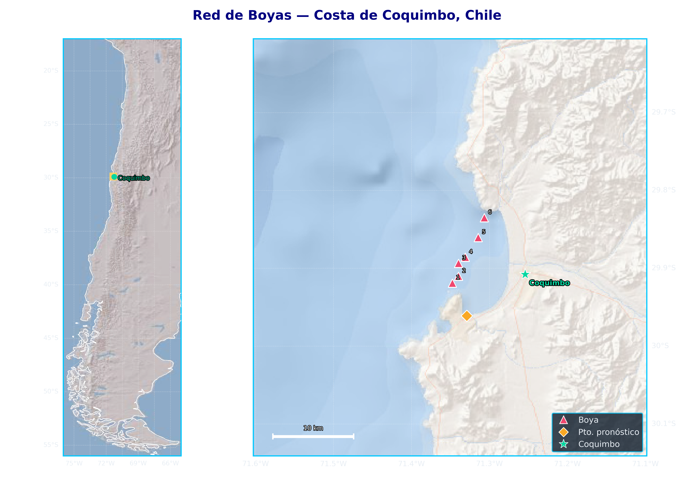
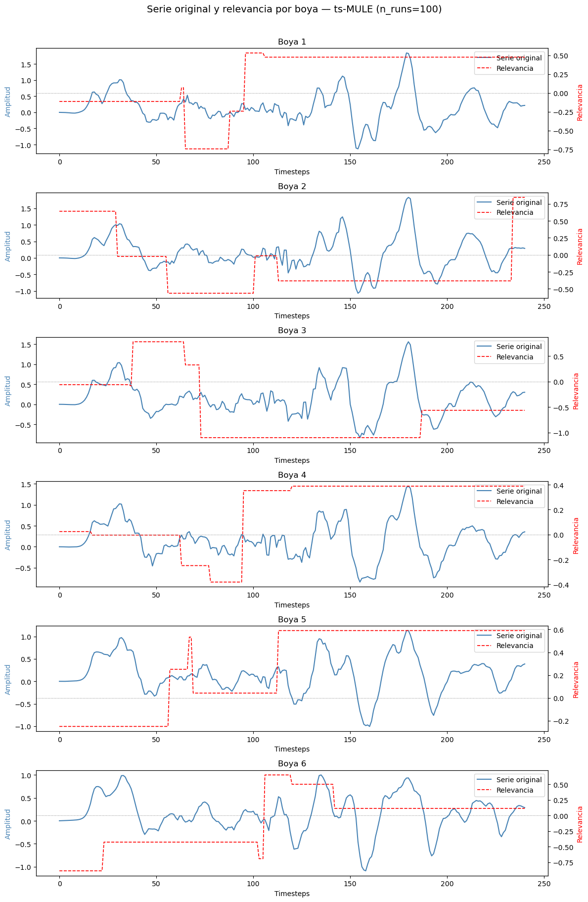
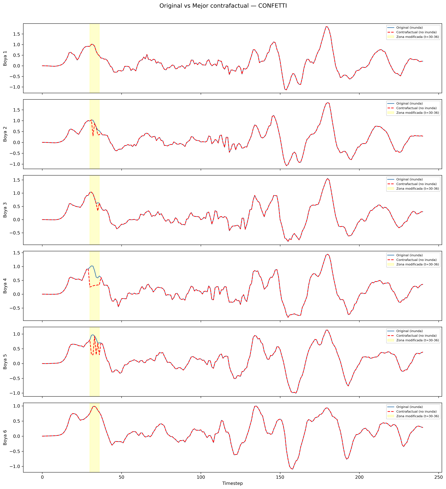
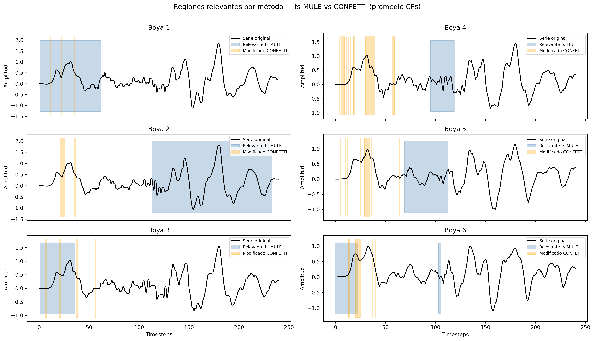

# XAI for Tsunami Time Series

Explainability analysis of a deep learning model for tsunami classification using time series data from buoy sensors. This repository implements and compares two XAI (Explainable Artificial Intelligence) methods: **ts-MULE** (Schlegel et al. 2021) and **CONFETTI** (Cetina et al. 2026), to explain predictions of a modified version of the model proposed by Núñez et al. (2022). As an additional contribution, explicit fidelity metrics for both methods quality evaluation are implemented.

---

## 📌 Overview

This repository contains the development of the course project for **Introduction to Explainable Artificial Intelligence (INF473)**, 2026, at Universidad Técnica Federico Santa María.

The project applies XAI techniques to interpret the predictions of a 1D-CNN model trained to classify tsunami inundation events from multivariate time series recorded by a network of 6 virtual buoys located off the coast of Coquimbo, Chile. As a tsunami propagates from deep ocean toward the coast, the buoys record the wave signal before it reaches shore. The model uses these 6 simultaneous time series as input and predicts whether the event will cause inundation at a forecast point near Coquimbo (see figure below).

<p align="center">
  
</p>

Two different XAI methods are implemented and compared: **ts-MULE** (Schlegel et al. 2021) and **CONFETTI** (Cetina et al. 2026), identifying which temporal regions and buoys are most relevant for the model's decisions. The figures below show the main results of the analysis: (1) Regions of relevance indentified by TS-MULE, (2) Counterfactual generated with CONFETTI, and (3) a joint analysis overlapping the relevant regions identified by each method across, all three figures for all 6 buoys for a representative instance. Additionally, a relative importance of the 6 buoys to the prediction of one instance was implemented, consistently resulting on identifying the buoy 6 as the one that provides more information to the prediction.


<p align="center">
  
  
  
</p>

As an additional contribution, explicit fidelity metrics for evaluation were implemented. 

For CONFETTI we used the 4 conditions based on Molnar (2023): (1) change of class, (2) diversity, (3) proximity, and (4) plausibility. For the latter, we propose a spectral analysis that is physically motivated by the resonance properties of Coquimbo bay (Catalán et al. 2025).

For TS-MULE, two fidelity metrics were implemented: (1) Segment-level Deletion and (2) Segment-level Insertion. Both act directly over the segments identified by TS-MULE, which is appropriate given the explanation generated has a local segmentation nature.

Finally, a joint analysis was carried out to account the concordancy between both methods, as a proxy to a joint fidelity metric, which is independet from the metrics described above. Here we answer "which of the timesteps modified by CONFETTI occur inside a window indetified as relevant by TS-MULE" (recall).

---

## 🌊 Methods

### ts-MULE
Local perturbation-based explainability method adapted for time series. Generates relevance scores for each timestep and feature by fitting a local linear model (Lasso regression) over perturbed samples (Schlegel et al. 2021).

### CONFETTI
Counterfactual explanation method for time series. Generates counterfactual instances — minimal modifications to the input that would change the model's prediction — using a genetic algorithm (Cetina et al. 2026).


---

## 🗂️ Repository Structure

```
├── xai_utils/                  # Main XAI utility module
│   ├── __init__.py
│   ├── tsmule_analysis.py      # TS-MULE analysis function
│   ├── tsmule_plots.py         # TS-MULE plotting functions
│   ├── tsmule_convergence.py   # TS-MULE convergence analysis
│   ├── confetti_analysis.py    # CONFETTI analysis function
│   ├── confetti_plots.py       # CONFETTI plotting functions
│   ├── confetti_convergence.py # CONFETTI convergence analysis
│   ├── fidelidad_confetti.py   # Fidelity metrics for CONFETTI
│   └── comparison_plots.py     # Comparative plotting functions
│
├── 0X_name.ipynb               # Introductory files, data and model setup
├── 1X_name.ipynb               # CONFETTI implementation (Cetina et al. 2026)
├── 2X_name.ipynb               # TS-MULE implementation (Schlegel et al. 2021)
├── 3X_name.ipynb               # Joint analysis using both methods
├── 4x_name.ipynb               # Fidelity metrics 
│
├── DATA/                       # Dataset (see Data section for download)
├── MODELS/                     # Trained models (see Installation for download)
├── FIGS/                       # Empty folder for results (codes fail if doesn't exist)
├── RESULTADOS_COMPARACION/     # Empty folder for results (codes fail if doesn't exist)
├── RESULTADOS_MULTI/           # Empty folder for results (codes fail if doesn't exist)
├── RESULTADOS_CONFETTI/        # Empty folder for results (codes fail if doesn't exist)
├── RESULTADOS_TSMULE/          # Empty folder for results (codes fail if doesn't exist)
├── METHODS/                    # Place TS-MULE and CONFETTI repositories here
├── CONVERGENCIA_CONFETTI/      # Empty folder for results (codes fail if doesn't exist)
├── CONVERGENCIA_TSMULE/        # Empty folder for results (codes fail if doesn't exist)
├── INFORMES/                   # Project reports (PDF format)
├── requirements.txt            # Project dependencies
├── .gitignore
└── README.md
```

---

## ⚙️ Installation

1. Clone the repository:
```bash
git clone https://github.com/msifon/Proyecto-XAI-2026.git
cd Proyecto-XAI-2026
```

2. Create and activate a conda environment:
```bash
conda create -n xai_tsunami python=3.12
conda activate xai_tsunami
```

3. Download and install the required packages:

| Package | Download | Description |
|:---|:---:|:---|
| ts-MULE | [Download](https://drive.google.com/drive/folders/1kvca5dyYCNOYtVMljw_yGAYRRfMGBfze?usp=drive_link) | Modified version with bug fixes (required) |
| CONFETTI | [Download](https://drive.google.com/drive/folders/1PipK4KWZqMZ6Ua5apq4kpOO7e0c_0M9J?usp=drive_link) | Optional — available on PyPI |

   Once downloaded, follow the installation instructions for each package:

   **TS-MULE** — No installation required. Download the folder and place it in `METHODS/ts-mule/` at the root of the repository. Then add it to the 
   Python path at the beginning of each notebook:
```python
   import sys
   sys.path.insert(0, 'METHODS/ts-mule')
```

   **CONFETTI** — Available on PyPI. Install directly with:
```bash
   pip install confetti-ts
```
   Alternatively, download the package from the link above and install from its local directory:
```bash
   cd path/to/confetti
   pip install confetti-ts
```

4. Install remaining dependencies:
```bash
pip install -r requirements.txt
```
---

## 🚀 Usage

```python
from xai_utils import analyze_with_tsmule, analyze_with_confetti
from xai_utils import plot_relevance_map, plot_best_counterfactual
from xai_utils import plot_comparison_summary
from xai_utils.fidelidad_confetti import reporte_cf, evaluar_todos_cfs, search_best_cf

# ts-MULE analysis
resultados_tsmule = analyze_with_tsmule(
    model=model,
    x=instance,
    n_runs=300,
    feature_names=['Buoy 1', 'Buoy 2', 'Buoy 3', 'Buoy 4', 'Buoy 5', 'Buoy 6']
)

# CONFETTI analysis
resultados_cf = analyze_with_confetti(
    model_path_wrapped='MODELS/model_wrapped.keras',
    model_path_original='MODELS/model.keras',
    instance=instance,
    X_train=X_train,
    population_size=100,
    maximum_number_of_generations=200
)

# Comparative visualization
plot_comparison_summary(resultados_tsmule, resultados_cf)

# Fidelity evaluation
metricas = reporte_cf(
    original=instance[0], original_label=original_label,
    cf=resultados_cf['results'][0].best.counterfactual,
    cf_label=resultados_cf['results'][0].best.label,
    all_cfs=resultados_cf['results'][0].all_counterfactuals,
    nun=resultados_cf['results'][0].nearest_unlike_neighbour,
    X_train=X_train
)
```

---

## 📊 Suggested configuration

| Method | Optimal Parameters | Computation Time |
|:---:|:---:|:---:|
| TS-MULE | n_runs=300, n_samples=100 | ~9.8 min |
| CONFETTI | population_size=100, max_generations=200 | between 9.0 and 45 min* |


*Computation time is strongly dependent on the complexity of the instance being analysed  


---

## 🐛 Bug Fixes in TS-MULE

The following bugs were identified and corrected from the original ts-MULE repository. The modified version available for download in this repository already incorporates all these fixes.

| # | File | Function | Bug | Fix |
|:---:|:---|:---|:---|:---|
| 1 | `tsmule/xai/lime.py` | `LimeBase.explain()` | `segmentation_method='slope-max'` — incorrect method name | Changed to `'slopes-sorted'` |
| 2 | `tsmule/xai/lime.py` | `LimeBase._explain()` | `z_hat` shape `(n,1)` instead of `(n,)` caused null Lasso coefficients | Added `.flatten()` to `z_hat` |
| 3 | `tsmule/xai/lime.py` | `LimeTS.__init__()` | `Lasso(alpha=0.01)` too aggressive — produced almost all zero coefficients | Reduced to `alpha=0.0001` |
| 4 | `tsmule/xai/evaluation.py` | `PerturbationBase.mask_percentile()` | Strict `>` operator excluded values exactly equal to percentile, producing all-ones masks | Changed to `>=` with `method='lower'` |
| 5 | `tsmule/xai/evaluation.py` | `PerturbationBase._randomize()` | `n_ons` could become negative when `n_offs * (1 + delta) > n_steps` | Added `np.clip(n_offs, 0, n_steps)` |

---

## 📁 Data

The dataset used in this project consists of synthetic tsunami time series generated from numerical simulations, recorded by a network of 6 virtual buoys.

| Dataset | Download | Description |
|:---|:---:|:---|
| Data set | [Download](https://drive.google.com/drive/folders/1D_eD67j7sEbZy7gyZfP9cTYWzXqrEuoh?usp=drive_link) | X_train, y_train, X_val, y_val, X_test, y_test |

Once downloaded, place the files in a `DATA/` folder at the root of the repository:
```
├── DATA/
│   ├── X_train_new.pickle
│   ├── y_train_new.pickle
│   ├── X_val_new.pickle
│   ├── y_val_new.pickle
│   ├── X_test_new.pickle
│   └── y_test_new.pickle
```

---

## 📋 Requirements

- Python 3.12
- TensorFlow / Keras 2.21
- ts-MULE
- CONFETTI
- NumPy, Pandas, Matplotlib, Scikit-learn, SciPy

See `requirements.txt` for full dependency list.

---

## 👤 Authors

- **Matías Sifón, MSc** — PhD Student
- **Tomás Mercado** — MSc Student
- **Ignacio Muñoz** — B.Sc. Student
- **Raquel Pezoa, PhD** — Supervisor

**Institution:** Universidad Técnica Federico Santa María  
**Course:** INF473 - Introducción a XAI

---

## 📄 License

This project is for academic purposes only.

---

## 🔗 Reference Repositories

The methods implemented in this project are based on the following repositories:

| Method | GitHub |
|:---|:---|
| TS-MULE | [Repository](https://github.com/visual-xai-for-time-series/ts-mule) |
| CONFETTI | [Repository](https://github.com/serval-uni-lu/confetti) |

---

## 📚 References

- Catalán, P. A., et al. (2025). Toward the Classification of Bays Based on Their Resonant Response to Tsunamis. *Journal of Geophysical Research: Oceans*.

- Cetina, A. G. P., Benguessoum, K., Lourenço, R., & Kubler, S. (2026). Counterfactual Explainable AI (XAI) Method for Deep Learning-Based Multivariate Time Series Classification. *Proceedings of the AAAI Conference on Artificial Intelligence*, 17393–17400. 
[https://arxiv.org/abs/2511.13237](https://arxiv.org/abs/2511.13237)

- Molnar, C. (2023). *Interpretable Machine Learning* (3rd ed.).
[https://christophm.github.io/interpretable-ml-book](https://christophm.github.io/interpretable-ml-book)

- Núñez, J., Catalán, P. A., Valle, C., Zamora, N., & Valderrama, A. (2022). Discriminating the occurrence of inundation in tsunami early warning with one-dimensional convolutional neural networks. *Scientific Reports*, 12(1). 
[https://doi.org/10.1038/s41598-022-13788-9](https://doi.org/10.1038/s41598-022-13788-9)

- Schlegel, U., Lam, D. V., Keim, D. A., & Seebacher, D. (2021). TS-MULE: Local Interpretable Model-Agnostic Explanations for Time Series Forecast Models. *Joint European Conference on Machine Learning and Knowledge Discovery in Databases*, 5–14. 
[https://arxiv.org/abs/2109.08438](https://arxiv.org/abs/2109.08438)
